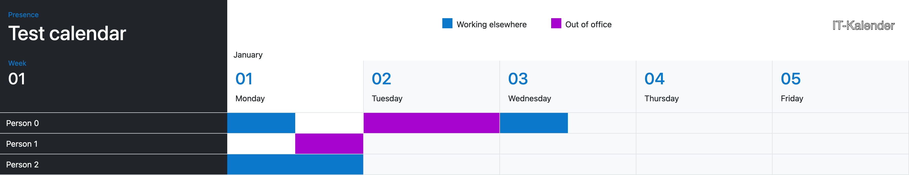

# IT Kalender

Shows when people are “Out of office” or “Working elsewhere”

* Only appointments lasting more than 2 hours are shown
* An appointment ending on or before 12:00 is show as starting at 08:00 and
  ending at 12:00

  
* An appointment starting on or after 12:00 is show as starting at 12:00 and
  ending at 16:00

  
* An appointment starting before 12:00 and ending after 12:00 is shown as at
  08:00 and ending at 16:00, i.e. as a full day

  

Calendar data is read using ICS feed URLs from Outlook (see [Getting ICS
URL](docs/UserGuide.md#getting-ics-url) in [the user guide](docs/UserGuide.md))
for details on how to get these URLs).

--------------------------------------------------------------------------------

* [deployment](docs/deployment.md)
* [development](docs/development.md)
