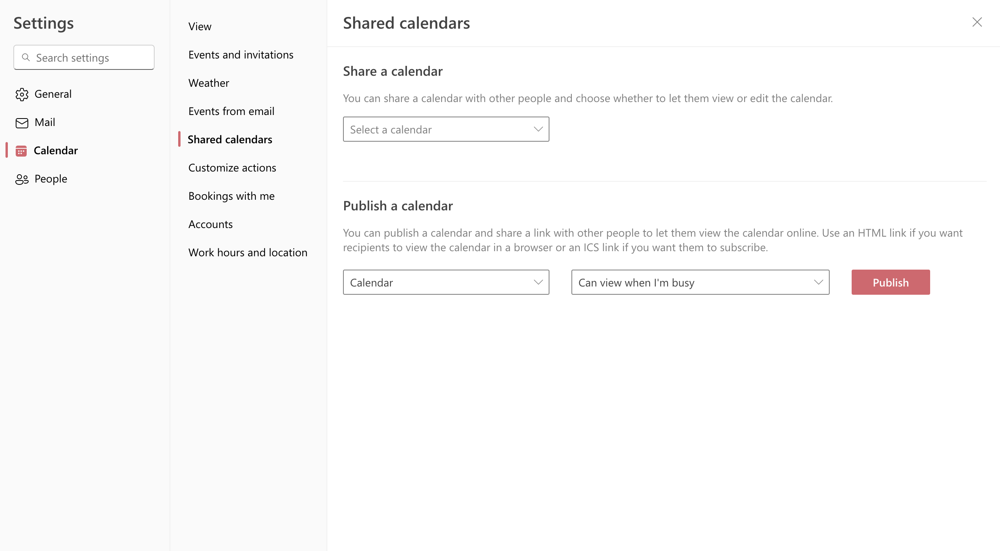

# User guide

## Getting ICS URL

1. Go to <https://outlook.office.com/calendar/options/calendar/SharedCalendars> and sign in.
2. Under “Publish a calendar”, choose your main calendar, “Can view when I’m busy” (or one of the other options) and click “Publish”
   
3. Click the on the ICS URL and “Copy link”
   
4. Send the copied URL to your calendar administrator
